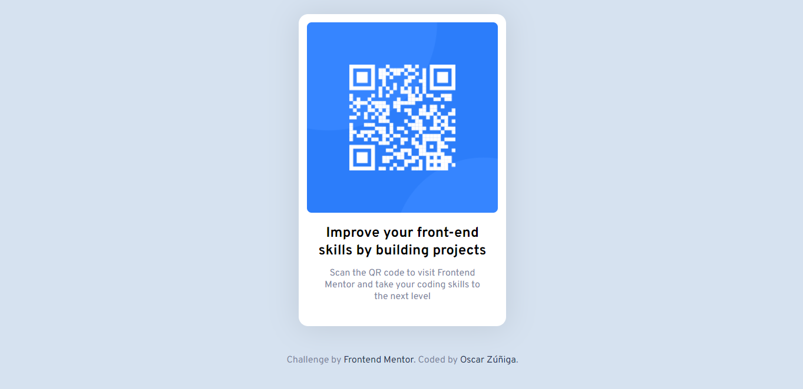

# Frontend Mentor - QR code component solution
 
This is a solution to the [QR code component challenge on Frontend Mentor](https://www.frontendmentor.io/challenges/qr-code-component-iux_sIO_H). Frontend Mentor challenges help you improve your coding skills by building realistic projects.
 
## Table of contents
 
- [Overview](#overview)
  - [Screenshot](#screenshot)
  - [Links](#links)
- [My process](#my-process)
  - [Built with](#built-with)
  - [What I learned](#what-i-learned)
  - [Continued development](#continued-development)
  - [Useful resources](#useful-resources)
- [Author](#author)
- [Acknowledgments](#acknowledgments)
 
 
## Overview
 
### Screenshot
 

 
### Links
- Live Site URL: (https://1994oscar.github.io/qr-code-component-chlg-02/)
 
## My process
 
### Built with
- Flexbox
- Mobile-first workflow
- Node-Sass 
 
 
## Author
 
- Website - [Oscar Zúñiga](https://www.xn--oscarziga-q6a2h.com/)
- Frontend Mentor - [@1994oscar](https://www.frontendmentor.io/profile/1994oscar)

